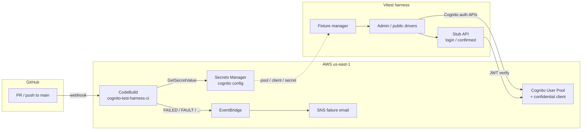

# Cognito test harness

Cognito **test harness** for confidential-client **admin auth** and public User Pool flows: fixture personas, outcome-based drivers, `SECRET_HASH`, JWT checks, refresh, temporary password, and deterministic TOTP. CDK and CodeBuild keep the User Pool and CI reproducible — **supporting infrastructure**, not the product under test.

First-release acceptance matrix, profiles, CI gate, and safe diagnostics: [`docs/first-release.md`](docs/first-release.md).

The HTTP stub (`POST /login`, `GET /confirmed`) wraps the confidential admin password port + access-token verify for in-process tests. It is **not** how most production apps authenticate end users.

## What this is / is not

| | |
|---|---|
| **Is** | Privileged **test infrastructure**: fixtures, admin + public drivers, ephemeral users, stub API, live scenario matrix |
| **Is not** | A product auth stack (Hosted UI, cookies, federated IdP, browser OAuth) |

**Stub login errors:** `app.ts` maps authentication rejections to `401 { error: "invalid credentials" }` (and related stub mappings); operational failures use safe diagnostics.

## Risks under test

- Wrong client secret / `SECRET_HASH` → Cognito auth fails (confidential-client footgun)
- Protected route accepts **access** tokens only — **ID** tokens rejected
- Tampered JWTs rejected by `aws-jwt-verify`
- Unknown user vs wrong password → same 401 body at the stub
- Non-rotating refresh; wrong-client refresh rejection
- `NEW_PASSWORD_REQUIRED` continue / policy / bad session
- Deterministic software-token MFA enroll + sign-in (including reused-code rejection)
- Ephemeral users cleaned up best-effort after the run
- Passwords/secrets never committed; reports use allowlisted fields only

## Coverage matrix

| Area | Covered | Not covered (deferred) |
|---|---|---|
| YAML / fixture provision | Yes | Extra personas without distinct scenarios |
| Stub happy path | `POST /login` → `GET /confirmed` | Browser UI |
| Negatives — credentials | Bad password; existence-hiding | Throttle / retry product UX |
| Negatives — JWT | Missing bearer; ID rejected; tampered access | Expired token (optional later) |
| Confidential client | Wrong `SECRET_HASH` | — |
| Refresh | Non-rotating RF-1…RF-5 | Device tracking / rotation product mode |
| Temporary password | NP-1…NP-4 | — |
| TOTP MFA | TP enroll / wrong / reuse on required live | SMS MFA, optional mfa-setup live profile |
| Error taxonomy | Outcomes + safe diagnostics | Full 5xx product mapping |

## What a red build means

| What fails | Interpretation |
|---|---|
| `infra:test` / `infra:synth` | CDK template, IAM, or stack wiring regression |
| `test:unit` | Unit contract broken (no AWS) |
| `test:http` | HTTP authentication stub contract broken (no AWS) |
| `preflight` | Manifest or live Cognito profile drift |
| `test:live:cognito` | Live Cognito scenario regression (password, JWT, refresh, temp password, TOTP) |
| Main `infra:deploy` step | Infra change did not apply (CloudFormation / CDK) |

PR green does **not** prove a new Cognito pool policy is safe — PRs test the **currently deployed** pool. For infra changes, deploy locally first so PR CI sees the new policy; otherwise policy is applied on **main** deploy and re-tested there. See [CI design](#ci-design-one-pool-deploy-on-main-only).

## Architecture



CDK (`infra/`) owns the pool, secret, CodeBuild project, and alerting. CI and local tests materialize Cognito config from Secrets Manager into owner-only `.cognito/config.json`; the client secret never appears in stack outputs or git. Pool and config secret use `RemovalPolicy.DESTROY` for this throwaway demo — **do not copy that into a shared or production account** without `RETAIN`.

## Prerequisites

- Node.js 20+
- AWS CLI profile that can call Cognito admin APIs and deploy CloudFormation (this repo uses `AWS_PROFILE=cognito-dev`)
- Stack deployed once — bootstrap, SSM alert email, GitHub PAT, and `env:pull` are in [`infra/README.md`](infra/README.md)

## How to run tests

```bash
export AWS_PROFILE=cognito-dev
export AWS_REGION=us-east-1
npm run env:pull   # writes .cognito/config.json + bootstrap .env — never commit them

npm install
npm test                  # unit + HTTP only (no AWS)
npm run test:unit         # fast unit suite
npm run test:http         # HTTP stub suite (no AWS)
npm run preflight         # validate manifest + live Describe (no users)
npm run test:live:cognito # serial live matrix (includes TOTP)
npm run ci:gate           # full ordered PR gate (needs AWS after preflight)
```

See [`docs/first-release.md`](docs/first-release.md) for profiles, scenario inventory, safe diagnostics, and cleanup.

### Growth posture

The harness is shaped for additional personas, focused Cognito risk scenarios, and concurrent runs. Each fixture run uses a full UUID in its email aliases and tracks user ownership before password assignment so partial setup failures remain cleanable. Confidential-client negatives keep their Cognito command wiring in a focused probe module instead of rebuilding it in each test.

Personas should be added only with distinct scenario assertions. A generic identity-provider abstraction is intentionally deferred until a second provider or offline adapter creates a real seam.

## CI overview

All automated checks run in **CodeBuild** (not GitHub Actions). Project: `cognito-test-harness-ci`. Spec: [`buildspec.yml`](buildspec.yml).

| Trigger | What runs |
|---|---|
| **Pull request** (open/sync/reopen → `main`) | `ci:gate`: typecheck → unit → HTTP → infra → synth → preflight → live Cognito including TOTP (**no** deploy) |
| **Push to `main`** | If `infra/` changed → `cdk deploy`, then the same gate |

Cognito config is **materialized from Secrets Manager** (`cognito-test-harness/cognito`) into `.cognito/config.json` at the start of each build (`COGNITO_CONFIG_PATH`). The CodeBuild service role reads that secret and calls Cognito (no AWS access keys in GitHub).

### CI design: one pool, deploy on main only

This is a **solo demo** with a single long-lived Cognito stack (no separate `dev` / `ci` environments by choice).

| Behavior | Why |
|---|---|
| **PRs do not deploy** | `scripts/codebuild-pre-build.sh` deploys only on `PUSH` to `main` when `infra/` changed |
| **PR `test:live:cognito` hits the currently deployed pool** | Config comes from Secrets Manager for that live stack — not from the PR’s undeployed template |
| **Infra policy is applied on main** | After merge, main deploy updates the pool; the same Cognito checks then re-run against the new policy |

Tradeoff: a PR that only changes Cognito pool settings can go **green against today’s pool**, then fail (or change behavior) **after** main deploy. That is accepted here to keep CI simple and avoid shared-stack deploys from every PR.

**Solo workflow for infra PRs:** deploy the stack locally first (`npm run infra:deploy`) so PR CI exercises the new pool policy. Main deploy after merge is often a no-op confirm.

### Deploy power and branch protection

On main, when `infra/` changes, CodeBuild `sts:AssumeRole`s into the CDK bootstrap deploy roles — intentional for this public demo. Mitigations on `main`:

- Required status check: `AWS CodeBuild us-east-1 (cognito-test-harness-ci)`
- Branch must be up to date before merge
- No force-push / no deleting `main`
- Rules enforced for administrators

PRs never deploy; only main + `infra/` path changes can apply CloudFormation updates via CI.

## Layout

```text
buildspec.yml              CodeBuild install / pre_build / ci:gate
scripts/                   pre_build, ci-gate, preflight, env:pull
infra/                     CDK app (see infra/README.md for ops)
src/                       outcomes, drivers, fixtures, stub API, JWT verify
testData/users.yaml        personas (key + emailPrefix)
tests/unit|http|live       named suites (default npm test = unit+http; live includes TOTP)
```

## Security

- Do not commit `.env`, `.cognito/`, client secrets, or tokens; do not log generated passwords
- Cognito client secret and GitHub PAT live only in Secrets Manager — never stack outputs or git
- CodeBuild uses a least-privilege IAM role (pool-scoped Cognito Admin + CDK deploy assume-role); deploy-on-main is gated by branch protection above
- Public repo: keep secrets out of docs/issues/screenshots; rotate client secret / PAT after any exposure (see [`infra/README.md`](infra/README.md#rotate-cognito-client-secret))

## Possible extensions

- Separate `dev` / `ci` stacks if local experiments must never share the CI pool
- Expired / wrong-pool JWT negatives; login error taxonomy (5xx vs 401)
- Challenge flows (`FORCE_CHANGE_PASSWORD`, MFA) and refresh-token path
