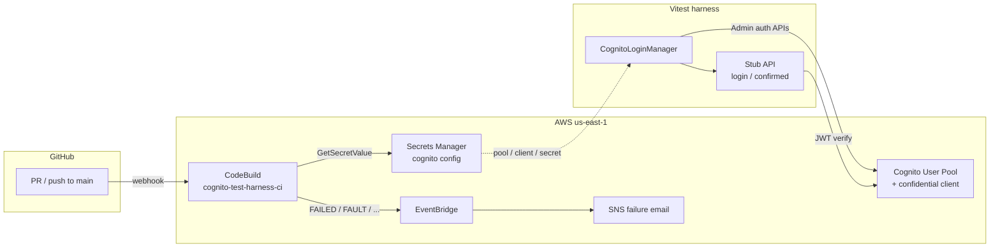

# Cognito test harness

Cognito **test harness** for confidential-client **admin auth**: YAML user lifecycle, `SECRET_HASH`, and JWT verification via a thin stub API. CDK and CodeBuild keep the User Pool and CI reproducible — **supporting infrastructure**, not the product under test.

The server holds the app client secret, computes `SECRET_HASH`, and authenticates with `AdminInitiateAuth` (`ADMIN_USER_PASSWORD_AUTH`). This pool requires **Username to be an email**; uniqueness uses a Gmail `+runId` alias per test run.

## What this is / is not

| | |
|---|---|
| **Is** | Privileged **test infrastructure**: YAML provision, `AdminInitiateAuth` + `SECRET_HASH`, ephemeral users, stub API proving the manager |
| **Is not** | A product auth stack (SRP, Hosted UI, cookies, federated IdP, MFA challenges) |

The stub (`POST /login`, `GET /confirmed`) is a JSON wrapper over admin auth + access-token verify so tests can exercise the helper without a real UI. It is **not** how most production apps authenticate end users.

**Stub login errors:** `app.ts` maps every `loginUser` failure to `401 { error: "invalid credentials" }` by design (no Cognito outage → 5xx mapping yet).

## Risks under test

- Wrong client secret / `SECRET_HASH` → Cognito auth fails (confidential-client footgun)
- Protected route accepts **access** tokens only — **ID** tokens rejected
- Tampered JWTs rejected by `aws-jwt-verify`
- Unknown user vs wrong password → same 401 body (existence-hiding at the stub; pool has `preventUserExistenceErrors`)
- Ephemeral users (`emailPrefix+runId@…`) cleaned up best-effort after the run
- Passwords never committed; YAML personas carry prefixes only

## Coverage matrix

| Area | Covered | Not covered (deferred) |
|---|---|---|
| YAML provision + SDK login | Yes (`smoke` persona) | Extra personas without distinct scenarios |
| Stub happy path | `POST /login` → `GET /confirmed` (access token) | Browser UI |
| Negatives — credentials | Bad password; unknown user vs wrong password → same 401 body | Throttle / retry |
| Negatives — JWT | Missing bearer; **ID token rejected**; **tampered access token** | Expired token; wrong-pool issuer |
| Confidential client | **Wrong `SECRET_HASH` → AdminInitiateAuth fails** | — |
| Challenges / lifecycle | — | Unconfirmed, `FORCE_CHANGE_PASSWORD`, MFA, refresh token |
| Error taxonomy | All login failures → 401 | Cognito outage → 5xx |

## What a red build means

| What fails | Interpretation |
|---|---|
| `infra:test` / `infra:synth` | CDK template, IAM, or stack wiring regression |
| `test:unit` | Helper contract broken (`secretHash` known vector / password rules) |
| `npm test` | Live Cognito or stub API contract regression |
| Main `infra:deploy` step | Infra change did not apply (CloudFormation / CDK) |

PR green does **not** prove a new Cognito pool policy is safe — PRs test the **currently deployed** pool. For infra changes, deploy locally first so PR CI sees the new policy; otherwise policy is applied on **main** deploy and re-tested there. See [CI design](#ci-design-one-pool-deploy-on-main-only).

## Architecture



CDK (`infra/`) owns the pool, secret, CodeBuild project, and alerting. CI and local tests read Cognito config from Secrets Manager; the client secret never appears in stack outputs or git. Pool and config secret use `RemovalPolicy.DESTROY` for this throwaway demo — **do not copy that into a shared or production account** without `RETAIN`.

## Prerequisites

- Node.js 20+
- AWS CLI profile that can call Cognito admin APIs and deploy CloudFormation (this repo uses `AWS_PROFILE=cognito-dev`)
- Stack deployed once — bootstrap, SSM alert email, GitHub PAT, and `env:pull` are in [`infra/README.md`](infra/README.md)

## How to run tests

```bash
export AWS_PROFILE=cognito-dev
export AWS_REGION=us-east-1
npm run env:pull   # writes .env from Secrets Manager — never commit it

npm install
npm run test:unit  # no Cognito
npm test           # full suite (needs Cognito env)
```

Integration tests create and delete their own Cognito users via `CognitoLoginManager.setupUsers` / `cleanup` — no long-lived seed user is required. Optional local server (`npm start`) is not required for tests; Vitest uses in-process `app.request()`.

## CI overview

All automated checks run in **CodeBuild** (not GitHub Actions). Project: `cognito-test-harness-ci`. Spec: [`buildspec.yml`](buildspec.yml).

| Trigger | What runs |
|---|---|
| **Pull request** (open/sync/reopen → `main`) | infra Jest → `cdk synth` → `test:unit` → full `npm test` (**no** deploy) |
| **Push to `main`** | If `infra/` changed → `cdk deploy`, then the same checks |

Cognito env vars are **read from Secrets Manager** (`cognito-test-harness/cognito`) at the start of each build. The CodeBuild service role reads that secret and calls Cognito (no AWS access keys in GitHub).

### CI design: one pool, deploy on main only

This is a **solo demo** with a single long-lived Cognito stack (no separate `dev` / `ci` environments by choice).

| Behavior | Why |
|---|---|
| **PRs do not deploy** | `scripts/codebuild-pre-build.sh` deploys only on `PUSH` to `main` when `infra/` changed |
| **PR `npm test` hits the currently deployed pool** | Config comes from Secrets Manager for that live stack — not from the PR’s undeployed template |
| **Infra policy is applied on main** | After merge, main deploy updates the pool; the same Cognito checks then re-run against the new policy |

Tradeoff: a PR that only changes Cognito pool settings can go **green against today’s pool**, then fail (or change behavior) **after** main deploy. That is accepted here to keep CI simple and avoid shared-stack deploys from every PR.

**Solo workflow for infra PRs:** deploy the stack locally first (`npm run infra:deploy`) so PR CI exercises the new pool policy. Main deploy after merge is often a no-op confirm.

### Deploy power and branch protection

On main, when `infra/` changes, CodeBuild `sts:AssumeRole`s into the CDK bootstrap deploy roles — intentional for this public demo. Mitigations on `main`:

- Required status check: `AWS CodeBuild us-east-1 (cognito-test-harness-ci)`
- Branch must be up to date before merge
- No force-push / no deleting `main`
- Rules enforced for administrators

PRs never deploy; only main + `infra/` path changes can apply CloudFormation updates via CI.

## Layout

```text
buildspec.yml              CodeBuild install / pre_build / build
scripts/                   CI deploy-if-infra + env:pull
infra/                     CDK app (see infra/README.md for ops)
src/                       SECRET_HASH, CognitoLoginManager, stub API, JWT verify
testData/users.yaml        personas (key + emailPrefix)
tests/                     unit + Cognito integration
```

## Security

- Do not commit `.env`, client secrets, or tokens; do not log generated passwords
- Cognito client secret and GitHub PAT live only in Secrets Manager — never stack outputs or git
- CodeBuild uses a least-privilege IAM role (pool-scoped Cognito Admin + CDK deploy assume-role); deploy-on-main is gated by branch protection above
- Public repo: keep secrets out of docs/issues/screenshots; rotate client secret / PAT after any exposure (see [`infra/README.md`](infra/README.md#rotate-cognito-client-secret))

## Possible extensions

- Separate `dev` / `ci` stacks if local experiments must never share the CI pool
- Expired / wrong-pool JWT negatives; login error taxonomy (5xx vs 401)
- Challenge flows (`FORCE_CHANGE_PASSWORD`, MFA) and refresh-token path
