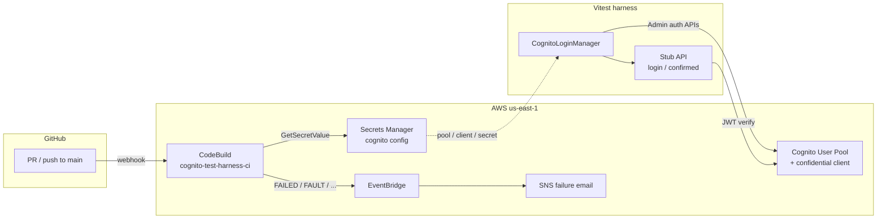

# Cognito test harness

TypeScript/Vitest harness for a **Cognito Traditional web app** (confidential client). The **server** holds the app client secret, computes `SECRET_HASH`, and authenticates with `AdminInitiateAuth`. Tests cover YAML-driven user provisioning, SDK login, and a stub HTTP API. Cognito infrastructure and **CodeBuild CI** are defined with **CDK** under `infra/`.

## What this demonstrates

- Confidential app client: `SECRET_HASH = Base64(HMAC-SHA256(client_secret, username + client_id))`
- Admin auth flow: `ADMIN_USER_PASSWORD_AUTH`
- YAML personas (no passwords in git)
- Unique users per run (`emailPrefix+runId@gmail.com`) + random passwords + best-effort `AdminDeleteUser` cleanup
- Stub API: `POST /login` (secret stays on the server) and `GET /confirmed` (Cognito JWT verify + confirmation payload)
- CDK-owned User Pool + confidential client (reproducible deploy)
- AWS CodeBuild CI (PR gate + main deploy-if-`infra/`) with an IAM service role (no GitHub Actions AWS keys)

This pool requires **Username to be an email**. Uniqueness comes from the Gmail `+runId` alias, not `user-${uuid}`.

## Architecture



CDK (`infra/`) owns the pool, secret, CodeBuild project, and alerting. CI and local tests read Cognito config from Secrets Manager; the client secret never appears in stack outputs or git.

## Prerequisites

- Node.js 20+
- AWS CLI profile that can call Cognito admin APIs and deploy CloudFormation (this repo uses `AWS_PROFILE=cognito-dev`)
- CDK bootstrap once per account/region (see Infra below)
- GitHub PAT in Secrets Manager for CodeBuild (see CI below)

## Infra (CDK)

Stack: `CognitoHarnessStack` in [`infra/`](infra/) — User Pool (email sign-in, no self-registration) + confidential app client with `ALLOW_ADMIN_USER_PASSWORD_AUTH` + CodeBuild project `cognito-test-harness-ci`.

```bash
cd infra
npm install

# once per account/region
npx cdk bootstrap --profile cognito-dev

npx cdk synth --profile cognito-dev
npx cdk deploy --profile cognito-dev
```

From the repo root you can also run `npm run infra:synth` / `npm run infra:deploy` / `npm run infra:test`.

### Cognito config → `.env`

After deploy, pull config from Secrets Manager (never commit `.env`):

```bash
export AWS_PROFILE=cognito-dev
export AWS_REGION=us-east-1
npm run env:pull
```

Secret name: `cognito-test-harness/cognito` (JSON: `userPoolId`, `clientId`, `clientSecret`, `region`).  
Stack output `CognitoConfigSecretName` points at that secret. Pool/client ids and region are also non-secret stack outputs for convenience — the **client secret is not** a CloudFormation output.

Keep `AWS_PROFILE=cognito-dev` (or your deploy profile) in `.env` for local Cognito Admin API calls.

Integration tests create and delete their own Cognito users via `CognitoLoginManager.setupUsers` / `cleanup` — no long-lived seed user is required.

## Setup

```bash
export AWS_PROFILE=cognito-dev
npm run env:pull   # writes .env from Secrets Manager — never commit it

npm install
npm test          # full suite (needs Cognito env)
npm run test:unit # no Cognito
```

### CI — AWS CodeBuild

All automated checks run in **CodeBuild** (not GitHub Actions). Project: `cognito-test-harness-ci`. Spec: [`buildspec.yml`](buildspec.yml).

| Trigger | What runs |
|---|---|
| **Pull request** (open/sync/reopen → `main`) | infra Jest → `cdk synth` → `test:unit` → full `npm test` (**no** deploy) |
| **Push to `main`** | If `infra/` changed → `cdk deploy`, then the same checks |

Cognito env vars are **read from Secrets Manager** (`cognito-test-harness/cognito`) at the start of each build so CI stays aligned if the pool/client is replaced. The CodeBuild service role reads that secret and calls Cognito (no AWS access keys in GitHub).

#### Failure email (SNS)

CodeBuild failures publish to SNS topic `cognito-test-harness-ci-alerts` via EventBridge. The email includes build status, build ID, and a CodeBuild console logs link. Deploy with your inbox:

```bash
export AWS_PROFILE=cognito-dev
export AWS_REGION=us-east-1
export ALERT_EMAIL=you@example.com
npm run infra:deploy
```

After deploy, **confirm the AWS subscription email** (Subject like "AWS Notification - Subscription Confirmation") or you will not receive alerts. On later main deploys, CodeBuild reuses the live stack `AlertEmail` output so the synth placeholder does not overwrite your inbox.

#### One-time: GitHub PAT for CodeBuild

Create a fine-grained or classic PAT with access to this repo (`repo` / contents + webhooks as required — still needed for CodeBuild clone/webhooks on a public repo). Store it in Secrets Manager **before** (or as part of) deploy:

```bash
aws secretsmanager create-secret \
  --name cognito-test-harness/github-pat \
  --secret-string 'YOUR_GITHUB_PAT' \
  --profile cognito-dev \
  --region us-east-1
```

Then:

```bash
export ALERT_EMAIL=you@example.com   # required for SNS failure alerts
npm run infra:deploy
```

CodeBuild will register a GitHub webhook and report status checks on PRs. Confirm the SNS subscription email after deploy.

You can remove obsolete **GitHub Actions** repository secrets (`AWS_ACCESS_KEY_ID`, etc.) once CodeBuild is green — they are unused.

Optional local server (not required for tests; Vitest uses in-process `app.request()`):

```bash
npm start   # http://localhost:3000
```

## Layout

```text
buildspec.yml              CodeBuild install / pre_build / build
scripts/
  codebuild-pre-build.sh   CI deploy-if-infra + load Cognito from SM
  env-pull.sh              local: Secrets Manager → .env
infra/                     CDK app (Cognito + CodeBuild + SM secret)
src/
  secretHash.ts            HMAC helper
  cognitoAuth.ts           Cognito client + env helpers
  cognitoLoginManager.ts   provision, login, credentials, cleanup
  app.ts                   POST /login, GET /confirmed
  jwtVerifier.ts           aws-jwt-verify (access token)
  server.ts                optional Node listener
testData/users.yaml        personas (key + emailPrefix)
tests/
  secretHash.test.ts
  randomPassword.test.ts
  cognito.integration.test.ts  YAML + API, shared beforeAll
```

## Security

- Do not commit `.env`, client secrets, or tokens
- Do not log generated passwords
- Do not put real Cognito IDs, client secrets, or PATs in git, issues, or PR screenshots
- Cognito client secret lives in Secrets Manager (`cognito-test-harness/cognito`), not in stack outputs or git
- CodeBuild uses a **least-privilege** IAM service role (pool-scoped Cognito Admin + `sts:AssumeRole` into CDK bootstrap roles — not PowerUser); GitHub PAT lives only in Secrets Manager for clone/webhooks

### Rotate Cognito client secret

Cognito does not rotate an app client secret in place. Replace the client (CDK construct id change), deploy, then refresh local env:

```bash
# After infra changes that replace the User Pool client:
export AWS_PROFILE=cognito-dev
export ALERT_EMAIL=you@example.com
npm run infra:deploy
npm run env:pull
npm test
```

Also rotate the GitHub PAT in `cognito-test-harness/github-pat` if it was ever pasted into chat or logs.

### Public repo hygiene

This repository is **public**. Keep it that way only while these remain true:

- [x] Client secret only in Secrets Manager (no CFN secret output)
- [x] `npm run env:pull` / CI never echo secret values
- [x] `.env` gitignored; no `.env` in git history
- [x] Cognito app client rotated after any past exposure; `env:pull` refreshed
- [x] GitHub PAT rotated if exposed; Secrets Manager updated
- [x] Docs use placeholders (`you@example.com`, `YOUR_GITHUB_PAT`) — no real secrets in README

## Possible extensions

Cognito here is **test infrastructure**, not a full multi-env product. Ideas if you extend the repo:

- Separate `dev` / `ci` stacks (local experiments vs long-lived CI pool)
- Thin browser UI over `POST /login` and `GET /confirmed` (secret stays on the server)
- Federated IdP (e.g. Google) via Cognito Hosted UI, with password YAML tests remaining the PR gate
