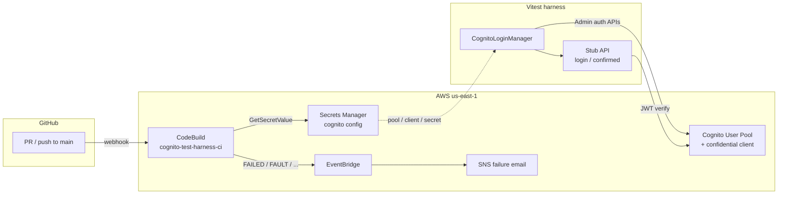

# Cognito test harness

Cognito **test harness** for confidential-client **admin auth**: YAML user lifecycle, `SECRET_HASH`, and JWT verification via a thin stub API. CDK and CodeBuild keep the User Pool and CI reproducible — **supporting infrastructure**, not the product under test.

The server holds the app client secret, computes `SECRET_HASH`, and authenticates with `AdminInitiateAuth` (`ADMIN_USER_PASSWORD_AUTH`). This pool requires **Username to be an email**; uniqueness uses a Gmail `+runId` alias per test run.

## What this is / is not

| | |
|---|---|
| **Is** | Privileged **test infrastructure**: YAML provision, `AdminInitiateAuth` + `SECRET_HASH`, ephemeral users, stub API proving the manager |
| **Is not** | A product auth stack (SRP, Hosted UI, cookies, federated IdP, MFA challenges) |

The stub (`POST /login`, `GET /confirmed`) is a JSON wrapper over admin auth + access-token verify so tests can exercise the helper without a real UI. It is **not** how most production apps authenticate end users.

**Stub login errors:** `app.ts` maps every `loginUser` failure to `401 { error: "invalid credentials" }` by design (no Cognito outage → 5xx mapping yet).

## Risks under test

- Wrong client secret / `SECRET_HASH` → Cognito auth fails (confidential-client footgun)
- Protected route accepts **access** tokens only — **ID** tokens rejected
- Tampered JWTs rejected by `aws-jwt-verify`
- Unknown user vs wrong password → same 401 body (existence-hiding at the stub; pool has `preventUserExistenceErrors`)
- Ephemeral users (`emailPrefix+runId@…`) cleaned up best-effort after the run
- Passwords never committed; YAML personas carry prefixes only

## Coverage matrix

| Area | Covered | Not covered (deferred) |
|---|---|---|
| YAML provision + SDK login | Yes (`smoke` persona) | Extra personas without distinct scenarios |
| Stub happy path | `POST /login` → `GET /confirmed` (access token) | Browser UI |
| Negatives — credentials | Bad password; unknown user vs wrong password → same 401 body | Throttle / retry |
| Negatives — JWT | Missing bearer; **ID token rejected**; **tampered access token** | Expired token; wrong-pool issuer |
| Confidential client | **Wrong `SECRET_HASH` → AdminInitiateAuth fails** | — |
| Challenges / lifecycle | — | Unconfirmed, `FORCE_CHANGE_PASSWORD`, MFA, refresh token |
| Error taxonomy | All login failures → 401 | Cognito outage → 5xx |

## What a red build means

| What fails | Interpretation |
|---|---|
| `infra:test` / `infra:synth` | CDK template, IAM, or stack wiring regression |
| `test:unit` | Helper contract broken (`secretHash` known vector / password rules) |
| `npm test` | Live Cognito or stub API contract regression |
| Main `infra:deploy` step | Infra change did not apply (CloudFormation / CDK) |

PR green does **not** prove a new Cognito pool policy is safe — PRs test the **currently deployed** pool. For infra changes, deploy locally first so PR CI sees the new policy; otherwise policy is applied on **main** deploy and re-tested there. See [CI design: one pool, deploy on main only](#ci-design-one-pool-deploy-on-main-only).

## Architecture



CDK (`infra/`) owns the pool, secret, CodeBuild project, and alerting. CI and local tests read Cognito config from Secrets Manager; the client secret never appears in stack outputs or git.

## Prerequisites

- Node.js 20+
- AWS CLI profile that can call Cognito admin APIs and deploy CloudFormation (this repo uses `AWS_PROFILE=cognito-dev`)
- Stack already deployed once (see [Infra](#infra-cdk-supporting-act)); CDK bootstrap once per account/region
- GitHub PAT in Secrets Manager for CodeBuild (see [CI setup](#ci-setup-sns--github-pat))

## How to run tests

```bash
export AWS_PROFILE=cognito-dev
export AWS_REGION=us-east-1
npm run env:pull   # writes .env from Secrets Manager — never commit it

npm install
npm run test:unit  # no Cognito
npm test           # full suite (needs Cognito env)
```

Integration tests create and delete their own Cognito users via `CognitoLoginManager.setupUsers` / `cleanup` — no long-lived seed user is required.

Optional local server (not required for tests; Vitest uses in-process `app.request()`):

```bash
npm start   # http://localhost:3000
```

## CI overview

All automated checks run in **CodeBuild** (not GitHub Actions). Project: `cognito-test-harness-ci`. Spec: [`buildspec.yml`](buildspec.yml).

| Trigger | What runs |
|---|---|
| **Pull request** (open/sync/reopen → `main`) | infra Jest → `cdk synth` → `test:unit` → full `npm test` (**no** deploy) |
| **Push to `main`** | If `infra/` changed → `cdk deploy`, then the same checks |

Cognito env vars are **read from Secrets Manager** (`cognito-test-harness/cognito`) at the start of each build. The CodeBuild service role reads that secret and calls Cognito (no AWS access keys in GitHub).

### CI design: one pool, deploy on main only

This is a **solo demo** with a single long-lived Cognito stack (no separate `dev` / `ci` environments by choice).

| Behavior | Why |
|---|---|
| **PRs do not deploy** | `scripts/codebuild-pre-build.sh` deploys only on `PUSH` to `main` when `infra/` changed |
| **PR `npm test` hits the currently deployed pool** | Config comes from Secrets Manager for that live stack — not from the PR’s undeployed template |
| **Infra policy is applied on main** | After merge, main deploy updates the pool; the same Cognito checks then re-run against the new policy |

Tradeoff: a PR that only changes Cognito pool settings can go **green against today’s pool**, then fail (or change behavior) **after** main deploy. That is accepted here to keep CI simple and avoid shared-stack deploys from every PR.

**Solo workflow for infra PRs:** deploy the stack locally first (`npm run infra:deploy`) so PR CI exercises the new pool policy. Main deploy after merge is often a no-op confirm.

### Deploy power and branch protection

On main, when `infra/` changes, CodeBuild `sts:AssumeRole`s into the CDK bootstrap deploy roles to update this stack — intentional and powerful for a public repo. Mitigations already configured on GitHub for `main`:

- Required status check: `AWS CodeBuild us-east-1 (cognito-test-harness-ci)`
- Branch must be up to date before merge
- No force-push / no deleting `main`
- Rules enforced for administrators

PRs never deploy; only main + `infra/` path changes can apply CloudFormation updates via CI.

## Layout

```text
buildspec.yml              CodeBuild install / pre_build / build
scripts/
  codebuild-pre-build.sh   CI deploy-if-infra + load Cognito from SM
  env-pull.sh              local: Secrets Manager → .env
infra/                     CDK app (Cognito + CodeBuild + SM secret)
src/
  secretHash.ts            HMAC helper
  cognitoAuth.ts           Cognito client + env helpers
  cognitoLoginManager.ts   provision, login, credentials, cleanup
  app.ts                   POST /login, GET /confirmed (stub)
  jwtVerifier.ts           aws-jwt-verify (access token)
  server.ts                optional Node listener
testData/users.yaml        personas (key + emailPrefix)
tests/
  secretHash.test.ts
  randomPassword.test.ts
  cognito.integration.test.ts  YAML + API, shared beforeAll
```

## Infra (CDK) — supporting act

Stack: `CognitoHarnessStack` in [`infra/`](infra/) — User Pool (email sign-in, no self-registration) + confidential app client with `ALLOW_ADMIN_USER_PASSWORD_AUTH` + CodeBuild project `cognito-test-harness-ci`.

The User Pool and Cognito config secret use `RemovalPolicy.DESTROY` so this **throwaway demo** stack can be deleted cleanly. **Do not copy that into a shared or production account** without switching to `RETAIN` (stack delete would wipe the pool and secret).

CodeBuild’s GitHub source defaults to this demo repo via CDK context in `infra/cdk.json` (`githubOwner` / `githubRepo`). Forks can override without code edits:

```bash
npx cdk deploy -c githubOwner=YOUR_USER -c githubRepo=YOUR_FORK --profile cognito-dev
# or edit infra/cdk.json context.githubOwner / context.githubRepo
```

```bash
cd infra
npm install

# once per account/region
npx cdk bootstrap --profile cognito-dev

# once: SNS alert inbox in SSM (not in git / buildspec)
aws ssm put-parameter \
  --name /cognito-test-harness/alert-email \
  --value 'you@example.com' \
  --type String \
  --overwrite \
  --profile cognito-dev \
  --region us-east-1

npx cdk synth --profile cognito-dev
npx cdk deploy --profile cognito-dev
```

From the repo root: `npm run infra:synth` / `npm run infra:deploy` / `npm run infra:test`.

`cdk synth` does **not** need `ALERT_EMAIL` — the stack references SSM `/cognito-test-harness/alert-email` (CloudFormation resolves it at deploy). Optional override for emergencies only: `ALERT_EMAIL=you@example.com` or `-c alertEmail=…` (placeholders like `*@example.com` / `*placeholder*` are rejected).

### Cognito config → `.env`

After deploy, pull config from Secrets Manager (never commit `.env`):

```bash
export AWS_PROFILE=cognito-dev
export AWS_REGION=us-east-1
npm run env:pull
```

Secret name: `cognito-test-harness/cognito` (JSON: `userPoolId`, `clientId`, `clientSecret`, `region`).  
Stack output `CognitoConfigSecretName` points at that secret. Pool/client ids and region are also non-secret stack outputs — the **client secret is not** a CloudFormation output.

Keep `AWS_PROFILE=cognito-dev` (or your deploy profile) in `.env` for local Cognito Admin API calls.

## CI setup (SNS + GitHub PAT)

### Failure email (SNS)

CodeBuild failures publish to SNS topic `cognito-test-harness-ci-alerts` via EventBridge. The email includes build status, build ID, and a link to the CodeBuild project history (paste the Build ID to open the exact run — EventBridge cannot URL-encode build ARNs for deep links).

**Source of truth:** SSM parameter `/cognito-test-harness/alert-email` (not `buildspec.yml`). Create or update once:

```bash
aws ssm put-parameter \
  --name /cognito-test-harness/alert-email \
  --value 'you@example.com' \
  --type String \
  --overwrite \
  --profile cognito-dev \
  --region us-east-1

export AWS_PROFILE=cognito-dev
export AWS_REGION=us-east-1
npm run infra:deploy
```

After deploy, **confirm the AWS subscription email** or you will not receive alerts. Changing the SSM value and redeploying updates the SNS subscription endpoint (re-confirm if AWS sends a new confirmation).

### One-time: GitHub PAT for CodeBuild

Create a fine-grained or classic PAT with access to this repo (`repo` / contents + webhooks as required — still needed for CodeBuild clone/webhooks on a public repo). Store it in Secrets Manager **before** (or as part of) deploy:

```bash
aws secretsmanager create-secret \
  --name cognito-test-harness/github-pat \
  --secret-string 'YOUR_GITHUB_PAT' \
  --profile cognito-dev \
  --region us-east-1
```

Then (SSM alert-email must already exist — see above):

```bash
npm run infra:deploy
```

CodeBuild registers a GitHub webhook and reports status checks on PRs. You can remove obsolete **GitHub Actions** repository secrets (`AWS_ACCESS_KEY_ID`, etc.) once CodeBuild is green — they are unused.

## Security

- Do not commit `.env`, client secrets, or tokens
- Do not log generated passwords
- Do not put real Cognito IDs, client secrets, or PATs in git, issues, or PR screenshots
- Cognito client secret lives in Secrets Manager (`cognito-test-harness/cognito`), not in stack outputs or git
- CodeBuild uses a **least-privilege** IAM service role (pool-scoped Cognito Admin + `sts:AssumeRole` into CDK bootstrap roles — not PowerUser); GitHub PAT lives only in Secrets Manager for clone/webhooks
- Deploy-on-main is gated by GitHub branch protection (required CodeBuild check); see [Deploy power and branch protection](#deploy-power-and-branch-protection)

### Rotate Cognito client secret

Cognito does not rotate an app client secret in place. Replace the client (CDK construct id change), deploy, then refresh local env:

```bash
export AWS_PROFILE=cognito-dev
npm run infra:deploy
npm run env:pull
npm test
```

Also rotate the GitHub PAT in `cognito-test-harness/github-pat` if it was ever pasted into chat or logs.

### Public repo hygiene

This repository is **public**. Keep it that way only while these remain true:

- [x] Client secret only in Secrets Manager (no CFN secret output)
- [x] `npm run env:pull` / CI never echo secret values
- [x] `.env` gitignored; no `.env` in git history
- [x] Cognito app client rotated after any past exposure; `env:pull` refreshed
- [x] GitHub PAT rotated if exposed; Secrets Manager updated
- [x] Docs use placeholders (`you@example.com`, `YOUR_GITHUB_PAT`) — no real secrets in README

## Possible extensions

Cognito here is **test infrastructure**, not a full multi-env product. Ideas if you extend the repo:

- Separate `dev` / `ci` stacks if local experiments must never share the CI pool (not required for this solo demo; see [CI design](#ci-design-one-pool-deploy-on-main-only))
- Expired / wrong-pool JWT negatives; login error taxonomy (5xx vs 401)
- Challenge flows (`FORCE_CHANGE_PASSWORD`, MFA) and refresh-token path
- Thin browser UI over `POST /login` and `GET /confirmed` (secret stays on the server)
- Federated IdP (e.g. Google) via Cognito Hosted UI, with password YAML tests remaining the PR gate
